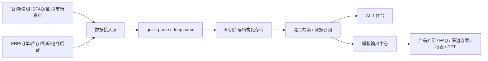

# AI Data Platform 项目方案

## 面向客户：Divoom / 深圳市战音科技有限公司

日期：2026-03-30  
版本：V1.0  
文档用途：客户沟通 / 方案评审 / 项目立项

---

## 1. 项目概述

我们建议基于 `ai-data-platform` 为 Divoom 构建一套面向产品、内容、渠道、客服与运营团队的企业级 AI 数据与知识工作台。

该平台不是一个单点聊天机器人，也不是简单的文档问答工具，而是一套能够将：

- 官网内容
- 产品资料
- 说明书 / FAQ / Warranty
- 证书与合规资料
- 展会与媒体内容
- 渠道素材
- ERP / 订单 / 库存 / 客诉等业务数据

统一接入、结构化理解、检索供料，并按模板输出给销售、客服、运营和管理层使用的 AI 中台。

对于 Divoom 这类兼具 `消费电子硬件 + 像素创意内容 + App 社区 + 海外渠道运营` 特征的品牌企业，核心挑战不是“有没有数据”，而是：

- 数据分散
- 资料版本多
- 团队回答口径不一致
- 面向不同市场和角色的内容重复生产成本高
- 产品、售后、市场、渠道数据难以形成统一知识闭环

`ai-data-platform` 的目标，就是把这些问题收束成一个可运营、可扩展、可追溯的平台能力。

---

## 2. 我们对客户业务的理解

以下理解基于贵司官网公开信息与产品页面内容整理，作为方案设计依据。

### 2.1 客户业务特征判断

从官网可见，Divoom 并非单一蓝牙音箱品牌，而是一个围绕以下能力展开的国际化消费电子品牌：

- 像素艺术硬件产品
- 蓝牙音箱与 LED 显示结合的创意设备
- 配套的 iOS / Android App
- 像素艺术在线社区与内容生态
- 面向全球市场的产品销售与渠道拓展
- 配套 FAQ、Warranty、Certificate、Media、Gallery 等内容体系

官网产品类别覆盖：

- Pixel Backpack
- Classic Speaker
- Lighting
- Pixel Speaker
- Pixel Factory

公开产品页面显示，Divoom 的产品不只是硬件本体，还强调：

- Pixel art creation
- Online gallery / community
- Mobile application
- Daily tools
- Smart alarm / sleep aid / notification
- Media / exhibition / global stores

这意味着贵司业务天然横跨以下几种信息形态：

- 结构化产品参数
- 半结构化售后知识
- 市场素材和内容资产
- 国际渠道说明与销售资料
- 用户社区内容与创意资产
- 未来可接入的订单、库存、售后、运营数据

### 2.2 我们理解到的核心业务痛点

结合品牌特征，我们判断贵司在数字化和 AI 化推进中，较可能面临以下问题：

1. **产品资料多源分散**

产品参数、卖点、图文素材、FAQ、证书、包装说明、媒体稿件往往分散在官网、网盘、文档、邮件、社媒素材、历史版本文件中，团队检索和复用效率低。

2. **多角色协作口径不一致**

销售、客服、海外渠道、市场、运营对同一产品的说法可能不同，导致对外输出不统一，尤其在新品发布、渠道问询、售后说明时容易出现信息偏差。

3. **全球化内容生产成本高**

官网、渠道页、展会资料、销售提案、FAQ、产品介绍、媒体摘要等内容，需要持续生产、重组和本地化，人工整理与改写成本高。

4. **售后与客服知识难沉淀**

FAQ、Warranty、设备功能说明、配网问题、使用场景说明等内容虽然存在，但未必能被客服和运营团队快速准确调用。

5. **业务数据与知识资产割裂**

即使后续接入 ERP / 订单 / 库存 / 客诉系统，如果没有统一平台，很难把“经营数据”和“产品知识”结合起来做真实决策支持。

### 2.3 对客户项目方向的理解

因此，我们认为这个项目最有价值的方向，不是做一个“通用 AI 助手”，而是做一个：

> 面向 Divoom 产品知识、品牌内容、渠道物料、客服支撑与经营分析的统一 AI 数据工作台

它需要同时满足：

- 对内提升资料检索和知识使用效率
- 对外提升销售、客服、市场输出的一致性
- 向后兼容 ERP / 数据系统接入
- 支撑未来更多产品线、渠道和区域市场的扩展

---

## 3. 项目建设目标

### 3.1 总体目标

建设一套可部署、可运营、可扩展的 AI 数据平台，帮助 Divoom 实现以下能力：

1. 产品、售后、内容、渠道资料统一入库
2. 资料自动解析、分类、摘要、结构化理解
3. 基于知识库进行可追溯问答
4. 按固定模板输出产品介绍、销售方案、FAQ、培训材料、渠道说明等内容
5. 分阶段接入 ERP / 订单 / 库存 / 客诉等业务系统，实现经营分析与知识融合

### 3.2 阶段目标

#### 第一阶段：知识底座建设

重点解决“资料找得到、看得懂、答得准、出得快”。

#### 第二阶段：数据接入与报表能力

重点解决“经营数据可问、可查、可视化输出”。

#### 第三阶段：业务协同与模板化输出

重点解决“让销售、市场、客服、管理层按角色直接使用”。

---

## 4. 方案定位

`ai-data-platform` 的定位不是替代贵司官网、ERP 或 App，而是作为这些系统之上的：

- 数据接入层
- 知识理解层
- 检索供料层
- 模板输出层
- 报告与工作台层

平台当前已经具备以下基础：

- 文档接入与上传
- quick parse / deep parse 双层解析
- 文档分类与 structured profile
- 混合检索与知识供料
- 对话工作台
- 数据源工作台
- 报表模板与输出中心
- 只读优先的系统接入策略

这意味着项目可以不是从零建设，而是基于现有平台能力，快速收敛为面向客户业务的行业方案。

---

## 5. 推荐建设范围

## 5.1 第一阶段：产品知识与内容中台

### 建设目标

将 Divoom 现有产品与内容资料统一沉淀为可调用知识资产。

### 推荐纳入资料范围

- 官网产品页
- 产品说明书
- FAQ
- Warranty 信息
- Certificate 证书资料
- 市场海报 / 媒体稿件 / 展会信息
- 渠道销售资料
- 客服话术与常见问题文档
- 产品规格表、包装信息、卖点说明

### 输出能力

- 面向内部团队的产品知识问答
- 面向销售的产品卖点与对比输出
- 面向客服的标准答复与问题定位
- 面向市场的产品内容重组
- 面向渠道的产品方案 / 介绍页 / 宣传文案

### 典型问题示例

- Pixoo Max、Pixoo、Ditoo、Timoo 的核心卖点差异是什么？
- 帮我整理一版适合海外渠道的产品介绍页结构。
- 根据 FAQ 和 Warranty 资料，总结客服常见问题及标准回答。
- 汇总某个产品所有证书和合规资料的状态。
- 基于现有内容生成一版新品展会介绍提纲。

## 5.2 第二阶段：运营与经营分析中台

### 建设目标

在知识底座稳定后，接入经营相关数据源，形成数据分析与知识结合的工作台。

### 推荐接入数据源

- ERP
- 订单系统
- 库存系统
- 售后 / 客诉系统
- 渠道报表
- 电商后台

### 典型分析方向

- 不同产品线销量趋势
- 热销 SKU 与低动销 SKU
- 区域市场表现对比
- 售后问题高频分布
- 渠道客户订单变化
- 退货 / 质保 / 咨询问题关联分析

## 5.3 第三阶段：模板化业务输出

### 面向销售

- 产品方案
- 客户提案
- 渠道介绍书
- SKU 对比卡

### 面向市场

- 新品卖点页
- 展会资料
- 社媒 / 新闻稿初稿
- 媒体摘要

### 面向客服

- FAQ 标准答复
- 售后排查 SOP
- 版本差异说明

### 面向管理层

- 周报 / 月报
- 经营分析 PPT
- 区域与渠道经营看板

---

## 6. 面向 Divoom 的业务价值

## 6.1 产品资料统一管理

把分散在产品文档、官网页面、市场资料、客服文档中的知识沉淀为统一知识库，降低找资料成本。

## 6.2 销售与客服一致输出

通过可追溯知识问答和模板化输出，保证不同团队对同一产品、同一问题的说法一致。

## 6.3 提升内容生产效率

减少市场和销售团队反复整理、改写、拼装资料的成本，加快提案、介绍页、对比稿和 FAQ 输出速度。

## 6.4 支撑多产品线与全球渠道扩展

贵司产品线较丰富、国际化属性明显，随着 SKU 和渠道增加，资料管理复杂度会持续上升。平台可作为长期增长底座。

## 6.5 为经营分析做好基础设施准备

将来接入订单、库存、售后数据后，平台可以直接升级为“知识 + 数据”双轮驱动的经营分析工作台。

---

## 7. 解决方案总览

## 7.1 整体思路

方案采用“统一接入、双层解析、混合检索、模板输出”的主线：

1. 外部资料进入平台
2. 平台完成快速理解与深度解析
3. 按知识库组织资料
4. 对话与输出按知识范围检索证据
5. 以模板驱动生成结构化结果

## 7.2 平台分层

### 1. 数据接入层

接入：

- 文档上传
- 官网公开网页
- 登录后后台页面
- 数据库
- ERP / 电商 / 业务系统

### 2. 解析理解层

进行：

- 文本抽取
- OCR fallback
- quick parse
- deep parse
- schemaType 识别
- structuredProfile 生成

### 3. 知识检索层

进行：

- 候选文件过滤
- 混合检索
- 证据块召回
- 结果 rerank

### 4. 模板输出层

支持：

- 文档
- 表格
- 静态页
- PPT
- 固定业务模板

### 5. 工作台层

提供：

- 首页问答工作台
- 文档中心
- 数据源工作台
- 报表中心
- 审计与权限能力

---

## 8. 结合客户业务的推荐应用场景

## 8.1 产品知识助手

面向销售、产品、市场、客服，快速回答：

- 某 SKU 的核心卖点
- 某系列产品差异
- 某产品功能说明
- 某产品证书与保修信息

## 8.2 渠道资料自动整理

把渠道介绍、产品参数、卖点、FAQ 统一重组，快速输出：

- 渠道版产品介绍
- 方案介绍页
- 规格对比表
- FAQ 手册

## 8.3 客服知识与售后支撑

基于 FAQ、Warranty、说明书、历史问题文档，形成：

- 标准答复模板
- 常见问题定位建议
- 版本差异解释
- 售后排障知识卡

## 8.4 官网与内容资产沉淀

针对官网产品页、Media、Gallery、Certificate 等公开资料做采集与知识化，避免内容资产只停留在页面层。

## 8.5 管理层经营分析

在后续接入业务数据后，支持：

- 产品线经营分析
- 区域市场分析
- 订单与库存分析
- 渠道表现分析
- 售后问题趋势分析

---

## 9. 平台功能设计建议

## 9.1 首页 AI 工作台

核心能力：

- 普通问答
- 按知识库问答
- 按模板输出
- 最近上传资料追问

建议面向客户展示的价值：

- 一句话问产品
- 一句话问文档
- 一句话问报表
- 一句话出方案

## 9.2 文档中心

建议作为“产品知识运营台”使用，管理：

- 产品资料
- FAQ
- Warranty
- 证书
- 展会资料
- 市场素材

## 9.3 数据源工作台

建议作为“资料和系统接入台”使用，管理：

- 官网采集
- 外部网页采集
- 登录后台采集
- 数据库连接
- ERP 接入

## 9.4 报表中心

建议作为“业务输出中心”，管理：

- 销售提案模板
- 客服模板
- 渠道输出模板
- 经营分析模板
- PPT / 页面 / 表格模板

---

## 10. 我们建议的实施路径

## Phase 1：4~6 周

目标：让平台先具备真实可用的产品知识与资料输出能力。

工作内容：

- 建立 Divoom 产品知识库
- 接入官网公开资料与内部文档
- 完成 quick parse / deep parse 主线
- 建立基础产品问答
- 建立 FAQ / Warranty / 产品介绍模板

交付结果：

- 可运行的客户版工作台
- 初始知识库
- 典型问答与模板输出能力

## Phase 2：4~8 周

目标：扩展到数据源与运营分析。

工作内容：

- 接入更多网页数据源
- 接入数据库 / ERP / 电商后台
- 增加只读分析能力
- 增加报表模板与导出能力

交付结果：

- 数据源接入台
- 经营分析报表
- 渠道 / 销售 / 客服的专题输出能力

## Phase 3：持续迭代

目标：形成长期运营平台。

工作内容：

- 权限体系
- 审计体系
- 多角色模板
- 自动报告
- 多区域 / 多渠道支持

---

## 11. 技术路线说明

## 11.1 平台基础

当前 `ai-data-platform` 已采用：

- Web 工作台
- API 服务
- Worker 异步任务
- 文档解析与分类
- 数据源接入框架
- 报表模板与输出中心

## 11.2 核心技术原则

### 只读优先

对客户现有系统不做写入，不改客户业务系统数据。

### 本地 / 私有部署优先

优先支持客户私有环境部署，满足资料和业务数据安全要求。

### 来源可追溯

回答与输出应尽量保留来源引用，降低幻觉风险。

### 结构化输出

不止回答问题，还要沉淀为文档、表格、PPT、页面等可复用资产。

---

## 12. 高层架构图

---

## 13. 项目交付物建议

建议首轮项目交付物包括：

1. 客户专属部署版 AI 工作台
2. 产品知识库初始化
3. 官网 / 文档 / FAQ / Warranty 首批接入
4. 产品问答与客服问答能力
5. 渠道资料 / 产品介绍模板
6. 项目实施文档
7. 管理员培训与使用说明

---

## 14. 项目成功标准

本项目建议以以下指标作为阶段性成功标准：

### 第一阶段

- 关键产品资料统一入库
- 常见产品问题可通过平台准确回答
- 销售 / 客服 / 市场能输出统一口径内容
- FAQ / 产品介绍可模板化生成

### 第二阶段

- 至少 1~2 类业务数据源成功接入
- 管理层可查看基础经营分析输出
- 平台形成“知识 + 数据”双轮能力

---

## 15. 风险与建议

### 15.1 风险

- 内部资料分散、版本不统一，会影响知识库质量
- 若缺乏统一的产品命名规范，会影响知识召回稳定性
- 若 ERP / 订单系统接口受限，第二阶段接入节奏可能受影响

### 15.2 建议

- 先把第一阶段做实，优先做“知识与内容中台”
- 用第一阶段成果服务销售、市场、客服 3 类角色，最快形成价值闭环
- 在业务真实使用后，再逐步接入经营数据

---

## 16. 结论

对于 Divoom 这样的国际化消费电子品牌，AI 项目的关键不在于单次问答是否“聪明”，而在于是否能把产品、内容、客服、渠道和经营数据真正沉淀成企业可复用资产。

`ai-data-platform` 适合承接这一目标，因为它不是单一聊天能力，而是一个围绕：

- 资料接入
- 知识解析
- 检索供料
- 模板输出
- 数据源扩展

构建的企业级 AI 工作台。

我们建议项目从 `产品知识与内容中台` 起步，先服务销售、市场、客服，再逐步延伸到 ERP、订单、库存、售后与经营分析，最终形成一个能够支持贵司产品增长、渠道扩展和全球化运营的 AI 数据平台。

---

## 17. 附：基于官网公开信息的客户理解依据

以下信息来自官网公开页面，作为方案理解依据：

- 官网含产品分类、媒体、展会、证书、FAQ、Warranty、About、Contact 等栏目
- 多款产品页面强调 Pixel Art、Online Community、Mobile Application、Daily Tools
- 产品生态覆盖硬件、内容、社区和 App，不是单一设备售卖
- 官网面向全球市场，具备海外渠道与国际传播属性

参考公开页面：

- 官网首页：https://divoom-gz.com/
- Timoo 产品页：https://www.divoom-gz.com/product/Timoo.html
- Pixoo 产品页：https://divoom-gz.com/product/pixoo.html
- Pixoo Max 产品页：https://www.divoom-gz.com/product/Pixoo-Max.html

