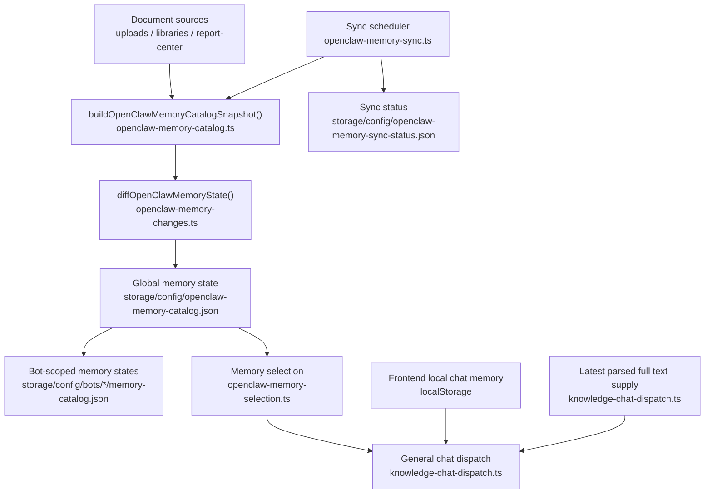

# OpenClaw Memory Configuration

Date: 2026-04-10

## Purpose

This document describes the current memory configuration used by the AI data platform after the Markdown-derived memory catalog was removed.

The current design keeps only runtime JSON state as the authoritative memory source for selection and sync status. Human-readable Markdown snapshots under `memory/catalog/` are no longer generated automatically and are not part of the runtime path.

## Structure Diagram



## Runtime Layers

### 1. Global OpenClaw Memory State

This is the runtime source of truth for cross-library memory-first selection.

File:
- `storage/config/openclaw-memory-catalog.json`

Produced by:
- `apps/api/src/lib/openclaw-memory-catalog.ts`

Contains:
- `version`
- `generatedAt`
- `documents`
- `recentChanges`

Important note:
- Despite the file name, this file does not store the full rendered library/template/output catalog.
- It stores the normalized document memory state and recent change log used for selection and bot scoping.

### 2. Sync Status Telemetry

This tracks whether the latest memory refresh is idle, scheduled, running, successful, or failed.

File:
- `storage/config/openclaw-memory-sync-status.json`

Produced by:
- `apps/api/src/lib/openclaw-memory-sync.ts`

Contains:
- current sync `status`
- requested / started / finished timestamps
- last success / last error
- pending reasons
- last result counts for libraries, documents, templates, outputs, and changes

This file is operational telemetry, not the memory source used by chat selection.

### 3. Bot-Scoped Memory Catalogs

Each enabled bot receives a filtered memory state derived from the global state and its library visibility rules.

Directory:
- `storage/config/bots/*/memory-catalog.json`

Produced by:
- `apps/api/src/lib/bot-memory-catalog.ts`

Behavior:
- default bot usually sees the broadest catalog
- channel or tenant bots get only documents visible to their allowed libraries
- selection can use the per-bot file directly, or fall back to global state when external access mapping requires it

### 4. Chat Runtime Consumption

Memory is used in two different ways during ordinary chat.

#### Memory-first candidate selection

Code:
- `apps/api/src/lib/openclaw-memory-selection.ts`

This layer:
- tokenizes the request
- scores candidate documents
- favors matching libraries, recent documents, and selectable parse states
- returns document ids that downstream retrieval can prefer

#### Latest detailed full-text supply

Code:
- `apps/api/src/lib/knowledge-chat-dispatch.ts`

This layer:
- finds the latest visible detailed document with full text
- injects the full text block into OpenClaw context
- does not depend on the memory catalog for the full text itself

This means the platform currently uses:
- memory state for candidate selection and continuity
- live parsed document state for actual full-text supply

### 5. Frontend Local Session Memory

The browser also maintains a separate local session memory. This is not part of the server-side OpenClaw memory system.

Files:
- `apps/web/app/lib/chat-memory.js`
- `apps/web/app/use-home-page-controller.js`

Stored in localStorage:
- `aidp_home_chat_history_v1`
- `aidp_home_chat_conversation_state_v1`

Purpose:
- keep recent chat history
- persist conversation state such as preferred document path across turns

This is UI/session memory, not long-term platform memory.

## Sync Triggers

Memory refresh is triggered by document and platform state changes.

Key trigger points include:
- document cache writes
- document override writes
- document library writes
- retained document writes
- deep parse success or failure
- report center state changes
- bot definition create or update

Manual refresh entry:
- `apps/api/src/scripts/refresh-openclaw-memory-catalog.ts`

Manual command:

```bash
corepack pnpm --filter api exec tsx src/scripts/refresh-openclaw-memory-catalog.ts
```

## Environment Variables

Current tunable values:

- `OPENCLAW_MEMORY_CATALOG_DOCUMENT_LIMIT`
  - default: `20000`
  - controls how many parsed documents are considered when rebuilding the memory state

- `OPENCLAW_MEMORY_SMALL_LIBRARY_DETAIL_LIMIT`
  - default: `20`
  - libraries at or below this size are treated as `deep`

- `OPENCLAW_MEMORY_MEDIUM_LIBRARY_DETAIL_LIMIT`
  - default: `80`
  - libraries above small and up to this size are treated as `medium`

- `OPENCLAW_MEMORY_SYNC_DEBOUNCE_MS`
  - default: `1500`
  - controls background sync debounce

## Data Flow

1. Parsed documents, document libraries, and report-center state are loaded.
2. A fresh in-memory snapshot is built.
3. The new document snapshot is diffed against the previous state.
4. The global memory state is written to `storage/config/openclaw-memory-catalog.json`.
5. Per-bot filtered states are regenerated under `storage/config/bots/*/memory-catalog.json`.
6. Sync status is updated in `storage/config/openclaw-memory-sync-status.json`.

## Why `memory/catalog/` Was Removed

The previous design generated Markdown snapshots such as:
- `memory/catalog/index.md`
- `memory/catalog/libraries/*.md`
- `memory/catalog/documents/*.md`
- `memory/catalog/templates/index.md`
- `memory/catalog/reports/index.md`

That layout had two problems:

1. It was not part of the runtime read path.
   - selection logic reads JSON state files, not Markdown snapshots
   - no runtime code depended on those Markdown files

2. It created a second observable state surface.
   - Markdown snapshots could look newer than sync-status telemetry
   - operators could see inconsistent counts and timestamps across files

The current design removes that duplicate state surface and keeps:
- one runtime memory state file
- one sync telemetry file
- per-bot derived state files

## Current Operational Checks

When validating memory health, check these files first:

- `storage/config/openclaw-memory-catalog.json`
- `storage/config/openclaw-memory-sync-status.json`
- `storage/config/bots/default/memory-catalog.json`

Healthy signs:
- `generatedAt` in global state is recent
- `lastResult.generatedAt` in sync status matches the latest refresh
- sync status is `success` or temporarily `scheduled` with a known pending reason
- bot-scoped catalogs exist for enabled bots

## Current Design Boundary

The current platform memory model is intentionally narrow:

- long-term server memory is JSON state
- bot memory is derived JSON state
- chat uses memory for candidate selection and continuity
- full text still comes from live parsed document state
- frontend localStorage only preserves user-session continuity

This keeps the system memory-first without reintroducing a second catalog format.
