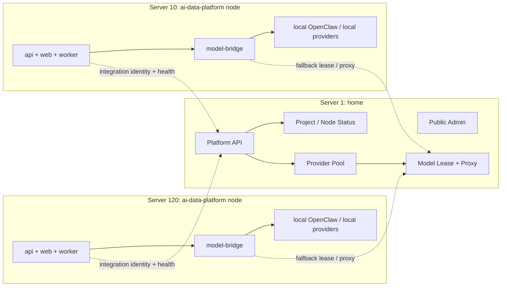

# Home Platform Node Deployment Design

**Goal:** Define the target deployment topology where `home` on server 1 acts as the shared control plane, provider pool, lease fallback, and fleet visibility layer, while `ai-data-platform` deployments on servers like 10 and 120 remain independently runnable application nodes.

**Status:** Design only. This document separates current behavior from target behavior so deployment discussions do not blur into "already implemented" claims.

---

## 1. Confirmed operating principles

The desired operating model is:

1. Every application node can run independently.
2. Local model capability remains preferred when present.
3. Server 1 owns the shared model pool and shared control plane.
4. Lease mode on server 1 is the fallback path for newly deployed assistants and degraded nodes.
5. Server 1 should be able to see every deployed assistant node, its OpenClaw/runtime access mode, and basic health state.
6. Future node rollout and node update actions should be orchestrated from server 1, not maintained as ad-hoc per-server scripts forever.

This matches the existing repository boundary:

- `home` owns shared model provider pool, shared policy, leases, proxy, and project integration state.
- `ai-data-platform` owns application runtime, project-local behavior, and the application-side integration contract.

References:

- [docs/DEPLOYMENT_SERVER.md](/C:/Users/soulzyn/Desktop/codex/ai-data-platform/docs/DEPLOYMENT_SERVER.md)
- [home/README.md](/C:/Users/soulzyn/Desktop/codex/home/README.md)
- [home/docs/project-integration-contract.md](/C:/Users/soulzyn/Desktop/codex/home/docs/project-integration-contract.md)

## 2. Current state vs target state

### 2.1 Current state

Today the stack already supports these pieces:

- `home` already has a shared provider pool and lease API.
- `ai-data-platform` nodes already support `HOME_PLATFORM_BASE_URL` and identity fields.
- `ai-data-platform` model bridge already supports `HOME_PLATFORM_BRIDGE_MODE=local-first|home-first`.
- Application nodes can already run independently with local provider keys.

What is not yet fully formalized:

- "server 1 pushes updates to 10/120" is not yet a first-class fleet operation.
- "all nodes report assistant status and OpenClaw status back to server 1" is only partially present through integration health and policy, not a complete fleet dashboard for app nodes.
- "all new nodes use lease as fallback by default" is not yet a clearly documented profile contract for `ai-data-platform`.

### 2.2 Target state

The intended target is:

- server 1 runs `home` as the shared control plane
- server 10, 120, and later nodes each run a standalone `ai-data-platform` app node
- each node uses local model access first if configured
- each node falls back to a lease or shared model path from `home` if the local path is unavailable or intentionally disabled
- server 1 can list and inspect all node integrations and node model access posture
- server 1 becomes the operator entrypoint for remote update and remote deploy actions

## 3. Target topology

## 4. Node roles

### 4.1 Server 1 role

Server 1 is the only shared platform server.

Responsibilities:

- shared admin UI
- shared platform API
- shared model provider pool
- shared model lease issuance
- shared model proxy
- project and node integration registry
- fleet visibility for deployed assistants and model access posture
- future remote deployment and remote update coordination

Server 1 should be the only place that stores centrally managed provider keys when a team wants centralized secret ownership.

### 4.2 Server 10 and 120 role

Servers 10 and 120 are application nodes.

Responsibilities:

- serve the app locally
- run local API, web, worker, and model bridge
- optionally host local OpenClaw and local provider credentials
- identify themselves to `home`
- consume shared leases or shared proxy only when needed

They should not grow their own shared admin backend, shared provider pool, or cross-project governance state.

## 5. Model access policy

### 5.1 Recommended policy

Use this policy for `ai-data-platform` nodes:

- default mode: `local-first`
- fallback mode: lease or proxy from `home`

This preserves node independence while still giving new nodes or degraded nodes a safe fallback.

### 5.2 Why not home-only by default

Making every node depend on `home` for every call would reduce resilience.

Local-first is better because:

- the node stays usable if server 1 is down
- local OpenClaw remains the fastest path
- local provider keys can still be used where needed
- lease fallback is reserved for recovery, rollout, and new-node bootstrap

### 5.3 Lease fallback rules

Recommended node behavior:

- if local OpenClaw and local provider path is healthy, use it
- if local provider path is missing, use `home`
- if local provider path fails, use `home`
- if policy explicitly disables local direct use, use `home`

This means lease mode is not the primary path for every node, but it is the guaranteed fallback path for every node.

## 6. Secret placement

### 6.1 Centrally managed secrets

Provider secrets such as `MINIMAX_API_KEY` should preferably live on server 1 when the team wants centralized control.

That means:

- server 1 owns shared provider credentials
- node servers do not need that provider key if they only rely on fallback lease/proxy

### 6.2 Node-side secrets

Every node still needs its integration identity and trust material:

- `HOME_PLATFORM_TOKEN`
- `HOME_PLATFORM_BASE_URL`
- `HOME_PLATFORM_PROJECT_KEY`
- `HOME_PLATFORM_PRINCIPAL_KEY`
- `HOME_PLATFORM_PRINCIPAL_LABEL`
- `HOME_PLATFORM_DEVICE_FINGERPRINT`

Optional local provider secrets remain allowed on nodes that should stay locally capable.

### 6.3 Practical rule

Use two deployment classes:

- full local node:
  - local provider keys present
  - `HOME_PLATFORM_BRIDGE_MODE=local-first`
  - fallback to server 1
- lean node:
  - no local provider keys
  - still `HOME_PLATFORM_BRIDGE_MODE=local-first`
  - effectively uses `home` as primary because local path is absent

This avoids introducing a second special mode just for new nodes.

## 7. Identity and fleet visibility

To let server 1 see every deployed assistant and node runtime clearly, every node must publish stable identity fields:

- `HOME_PLATFORM_PROJECT_KEY`
- `HOME_PLATFORM_PRINCIPAL_KEY`
- `HOME_PLATFORM_PRINCIPAL_LABEL`
- `HOME_PLATFORM_DEVICE_FINGERPRINT`

Recommended conventions:

- `HOME_PLATFORM_PROJECT_KEY=ai-data-platform`
- `HOME_PLATFORM_PRINCIPAL_KEY=server:<host-or-ip>`
- `HOME_PLATFORM_PRINCIPAL_LABEL=<human label>`
- `HOME_PLATFORM_DEVICE_FINGERPRINT=bridge:<host-or-ip>:<bridge-port>`

Examples:

- `server:10.0.0.10`
- `server:120.24.251.24`
- `AI-10`
- `AI-120`
- `bridge:120.24.251.24:18790`

### 7.1 What server 1 should show

The shared admin should eventually show, per node:

- node label
- project key
- environment
- health state
- current bridge mode
- local provider presence
- lease fallback availability
- local OpenClaw reachability
- last successful integration heartbeat
- deployed app version

This is the right place to answer "which assistants are deployed and what are they using right now".

## 8. Update flow after pushing to GitHub

### 8.1 Current safe workflow

Today, after code is pushed to GitHub:

1. update server 1 only if `home` changed
2. update server 10 independently
3. update server 120 independently
4. run per-node health checks

This is the current reality and should remain the fallback operating procedure.

### 8.2 Target workflow

Later, server 1 should become the operator entrypoint for node updates:

1. operator selects project and target nodes in `home`
2. server 1 triggers remote update action
3. node performs:
   - git pull
   - install if needed
   - build
   - restart services
   - post-update health check
4. node reports result back to server 1

This should be implemented as orchestration on top of the existing node-local deployment flow, not by inventing a second incompatible deployment mechanism.

## 9. Deployment profiles

`ai-data-platform` should ultimately define profiles like:

- `node-local-first`
- `node-lean-fallback`

Examples:

### 9.1 120 production profile

- independent app node
- local OpenClaw enabled
- local provider first
- `home` fallback enabled
- fully visible in server 1 control plane

### 9.2 10 production profile

Same shape unless intentionally simplified:

- independent app node
- local-first if local capability exists
- otherwise effectively `home` backed through fallback

### 9.3 New node profile

For a newly provisioned assistant node:

- deploy app node
- set identity and token
- do not require local provider key on day one
- let server 1 lease/proxy act as the working fallback
- add local OpenClaw or local providers later if needed

## 10. Recommended environment split

### 10.1 Server 1 (`home`)

Owns:

- provider pool credentials
- policy
- lease issuance
- admin state
- integration catalog

### 10.2 Node servers (`ai-data-platform`)

Must have:

- app runtime env
- integration identity env
- shared token

May have:

- local provider keys
- local OpenClaw runtime

## 11. Risks and mitigations

### Risk: confusion between "independent node" and "fully disconnected node"

Mitigation:

- document that node independence means the app can still run locally
- document that shared control plane and fallback access are additive, not mandatory for every request

### Risk: mixed deployment documents keep reintroducing per-server snowflakes

Mitigation:

- split deploy docs into common skeleton plus server profiles
- move server-specific overrides into profile-specific files

### Risk: lease fallback becomes invisible operationally

Mitigation:

- expose current bridge mode and fallback path in server 1 fleet view
- record lease issuance and fallback usage visibly in platform telemetry

## 12. Implementation sequence

Recommended order:

1. extract current 120-specific deployment rules into a `deploy/profiles/120` profile
2. create a parallel `deploy/profiles/10` profile
3. simplify [docs/DEPLOYMENT_SERVER.md](/C:/Users/soulzyn/Desktop/codex/ai-data-platform/docs/DEPLOYMENT_SERVER.md) to common app-node deployment only
4. define canonical node identity conventions
5. add server 1 fleet visibility for node assistant/OpenClaw state
6. add server 1 initiated remote update workflow
7. keep lease fallback as the default safety net for newly deployed nodes

## 13. Final recommendation

Adopt this as the official operating model:

- server 1 = shared platform, provider pool, leases, proxy, visibility, and future fleet operator
- server 10 and 120 = independently runnable `ai-data-platform` nodes
- local capability first
- lease fallback always available
- centralized provider credentials on server 1 where possible
- per-node identity and health registered back to server 1

This preserves resilience without giving up centralized governance.
